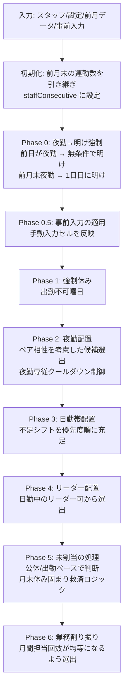

# シフト自動作成アプリ 仕様書

> 対象アプリ: 介護施設シフト自動作成アプリ
> 作成日: 2026-02-24 / 最終更新: 2026-03-14
> バージョン: 2.0

---

## 1. システム概要

介護施設（1F・2F）のシフト表を自動生成・管理するブラウザアプリ。

| 項目 | 内容 |
|------|------|
| 動作環境 | ブラウザ（Chrome / Edge 推奨）|
| ネットワーク | 不要（完全オフライン動作）|
| 配布方法 | `dist/index.html` 単体ファイル（ダブルクリックで起動）|
| データ保存 | ブラウザ LocalStorage（永続化）+ JSON ファイル（バックアップ）|

---

## 2. 技術スタック

| カテゴリ | 技術 | バージョン |
|----------|------|-----------|
| UI フレームワーク | React | 18.3.1 |
| 言語 | TypeScript | 5.6.3 |
| ビルドツール | Vite | 6.4.1 |
| CSS | Tailwind CSS | 3.4.17 |
| Excel 出力 | xlsx (SheetJS) | 0.18.5 |
| PDF 出力 | `window.print()` | - |
| バンドル方式 | vite-plugin-singlefile | 2.3.0 |
| テスト | Vitest | 3.x |

> [!NOTE]
> `npm run build` を実行すると `dist/index.html` に全 JS / CSS がインライン化される。  
> `npm run test` でユニットテストを実行できる（scheduler.ts 対象に6テスト）。

> [!TIP]
> **初心者向けコード解説について**
> 今回のアップデートにより、`src/lib/scheduler.ts` をはじめ、`context` や `pages` フォルダ内のすべての主要ファイルに、**「中学生でも読めるレベルの分かりやすい日本語解説コメント」**を追加しています。
> 各フェーズの役割や、React コンポーネント・型の目的がソースコード上で直接確認できるようになっています。

---

## 3. データモデル

### 3.1 型定義

```typescript
type Floor    = '1F' | '2F' | '非常勤'
type RoleType = '正社員' | 'パート' | '派遣'
type PairType = 'ng' | 'preferred'
type DutyType = 'ld' | 'bathing' | 'floor' | 'toilet' | 'onef'
// ※ 'onef' は「応援」（他フロアからの支援。必要人数カウント対象外。手入力専用）
```

### 3.2 Staff（スタッフ）

| フィールド | 型 | 説明 |
|---|---|---|
| `id` | string | 一意 ID |
| `name` | string | 氏名 |
| `floor` | Floor | 所属フロア |
| `role` | RoleType | 雇用形態 |
| `availableShiftTypes` | string[] | 対応可能シフト ID 配列 |
| `availableDuties` | DutyType[] | 対応可能業務 |
| `monthlyWorkDays` | number? | 月あたり出勤日数 |
| `weeklyWorkDays` | number? | 週あたり出勤日数 |
| `isNightOnly` | boolean? | 夜勤専従フラグ |
| `nightShiftMin` | number? | 月最低夜勤回数 |
| `nightShiftMax` | number? | 月最高夜勤回数 |
| `isShortTime` | boolean? | 短時間勤務フラグ（シフト表で I 表示）|
| `unavailableDow` | number[] | 出勤不可曜日（0=日〜6=土）|
| `tags` | string[] | タグ ID リスト（StaffTag.id を参照）|
| `memo` | string | メモ |

### 3.3 StaffTag（スタッフタグ）

| フィールド | 型 | 説明 |
|---|---|---|
| `id` | string | 一意 ID |
| `name` | string | タグ名（自由テキスト）|

スタッフにタグ（グループラベル）を付与するためのマスターデータ。先にタグを作成し、各スタッフに ID で紐づける。

### 3.4 ShiftType（勤務種別）

| フィールド | 型 | 説明 |
|---|---|---|
| `id` | string | 固定 ID |
| `name` | string | 名称 |
| `shortName` | string | 略称（表示用）|
| `startTime` / `endTime` | string | 勤務時刻 |
| `color` / `bgColor` | string | 表示色 |
| `isDayShift` | boolean | 日勤帯フラグ（自動配置対象）|
| `isNightShift` | boolean | 夜勤フラグ |
| `isAke` | boolean | 明けフラグ |
| `order` | number | 表示順 |

**デフォルトシフト種別:**

| ID | 名称 | 略称 | 時間 | 区分 |
|---|---|---|---|---|
| `early` | 早番 | L | 08:00〜16:30 | 日勤帯・自動 |
| `day` | 日勤 | B | 08:30〜17:00 | 日勤帯・自動 |
| `late` | 遅番 | U | 10:30〜19:00 | 日勤帯・自動 |
| `night` | 夜勤 | ○ | 16:30〜翌09:00 | 夜勤・自動 |
| `ake` | 明け | × | - | 明け（自動挿入）|
| `training` | 研修 | 研 | 09:00〜17:00 | 手入力専用 |
| `short` | 短時間 | I | 09:00〜16:00 | 日勤帯・自動 |
| `paid` | 有給 | 有 | - | 手入力専用 |
| `half_am` | 午前休 | B2 | 13:00〜17:00 | 手入力専用 |
| `half_pm` | 午後休 | B1 | 08:30〜12:30 | 手入力専用 |

> [!NOTE]
> `short / paid / half_am / half_pm` は月の必要勤務日数カウントに含めない（staffWorkDays に加算しない）。  
> シフト設定ページで人数設定が表示されるのは `early / day / late / night` のみ。

### 3.5 ShiftAssignment（シフト割当）

| フィールド | 型 | 説明 |
|---|---|---|
| `staffId` | string | スタッフ ID |
| `date` | string | 日付（YYYY-MM-DD）|
| `shiftTypeId` | string | シフト種別 ID または `'off'` |
| `isLeader` | boolean | リーダーフラグ |
| `isManual` | boolean? | 手入力フラグ（保護対象）|
| `duty` | DutyType? | 業務区分 |

### 3.6 FloorConfig（フロア設定）

| フィールド | 型 | 説明 |
|---|---|---|
| `floor` | Floor | 対象フロア |
| `shiftRequirements` | `Record<string, number[]>` | 各シフトの曜日別最低人数（7要素配列）|
| `shiftRequirementsEnabled` | `Record<string, boolean>` | シフト別有効/無効フラグ（後方互換で省略可）|
| `holidayShiftRequirements` | `Record<string, number>?` | 祝日専用のシフト別必要人数（省略可）|
| `useHolidayRequirements` | boolean? | 祝日専用設定を使うか（false/未設定 = 日曜人数を流用）|
| `dutyRequirements` | `Record<DutyType, number[]>` | 業務別曜日別必要人数 |
| `leaderCountPerDay` | number | 日勤リーダー人数/日 |
| `maxConsecutiveDays` | number | 最大連勤日数 |
| `monthlyOffDays` | number | 月の公休日数 |

### 3.7 PairSetting（ペア相性）

| フィールド | 型 | 説明 |
|---|---|---|
| `staffId1` / `staffId2` | string | 対象スタッフ |
| `type` | PairType | `ng`（不可）/ `preferred`（推奨）|
| `memo` | string | 備考 |

### 3.8 StaffDayComment（日別コメント）

特定スタッフの特定日に対するメモ。シフト表上に表示。

### 3.9 AppState（グローバル状態）

| フィールド | 説明 |
|---|---|
| `staffList` | スタッフ一覧 |
| `shiftTypes` | シフト種別一覧 |
| `floorConfigs` | フロア設定一覧 |
| `staffTags` | タグマスター一覧 |
| `pairSettings` | ペア相性設定 |
| `assignments` | シフト割当データ |
| `staffComments` | スタッフ日別コメント |
| `holidays` | **祝日リスト**（`'YYYY-MM-DD'` 形式の文字列配列。全フロア共通）|
| `currentFloor` / `currentYear` / `currentMonth` | 現在選択中の表示状態 |

### 3.10 その他

- **Generation Warning**: 自動生成後の警告（夜勤不足、人数不足）

---

## 4. 状態管理

- **方式**: React Context + `useReducer`
- **永続化**: state 変更時に `useEffect` で LocalStorage へ自動保存、起動時に自動読み込み
- **マイグレーション**: 既存データに新フィールドが欠けている場合はデフォルト値で補完
- **Undo 機能**: `useRef` によるスナップショットスタック（最大10回）。`SET_FLOOR` / `SET_MONTH` 以外のデータ変更アクションが Undo 対象
- **自動バックアップ**: 5分間隔で全 state を LocalStorage の別キー (`shift-app-backup`) に保存。サイドバーからダウンロード可能
- **保存失敗通知**: LocalStorage への保存が失敗した場合（容量超過等）、トースト通知でユーザーに警告

### アクション一覧

| アクション | 用途 |
|---|---|
| `SET_FLOOR` | フロア切替（Undo 対象外）|
| `SET_MONTH` | 表示月切替（Undo 対象外）|
| `SET_STAFF_LIST` | スタッフ一覧更新 |
| `SET_SHIFT_TYPES` | シフト種別更新 |
| `SET_FLOOR_CONFIGS` | フロア設定更新 |
| `SET_STAFF_TAGS` | タグマスター更新 |
| `SET_PAIR_SETTINGS` | ペア設定更新 |
| `SET_ASSIGNMENTS` | シフト割当更新 |
| `SET_STAFF_COMMENTS` | コメント更新 |
| `SET_HOLIDAYS` | 祝日リスト更新 |
| `DELETE_SHIFT_TYPE` | シフト種別削除（カスケード。削除後にスタッフの適性が空になる場合は中止）|
| `DELETE_STAFF` | スタッフ削除（割当・ペア・コメントを一括削除）|
| `PURGE_OLD_DATA` | 24ヶ月以上前のデータ削除 |
| `RESTORE_ALL` | 全データ復元（JSON 読み込み・Undo 時）|

---

## 5. 画面構成

### レイアウト

```
+--サイドバー------+--ヘッダー（月切替 ← → / 元に戻す / フロアタブ 1F・2F・非常勤）--+
|  ナビゲーション    |                                                          |
|  スタッフ管理      |                メインコンテンツエリア                        |
|  シフト設定       |                                                          |
|  相性設定         |                                                          |
|  シフト表         |                                                          |
|  ──────────── |                                                          |
|  データ保存（書き出し）|                                                       |
|  データ読み込み    |                                                          |
|  自動バックアップ保存 |                                                       |
|  v2.0 | 最終保存時刻 |                                                       |
+────────────+──────────────────────────────────────────────────+
```

**ヘッダー機能:**
- 月切替（← →）
- 「元に戻す」ボタン（Undo 履歴があるときのみ表示）
- Ctrl+Z キーボードショートカット対応

---

### 5.1 スタッフ管理（StaffPage）

スタッフの CRUD と並び替えを行う画面。

**設定項目:**
- 名前、フロア、雇用形態
- 対応可能シフト、対応可能業務
- 月出勤日数・週出勤日数上限
- 出勤不可曜日（曜日ボタン選択）
- 夜勤専従（ON/OFF + 月最低/最高回数）
- **短時間（ON/OFF）**: シフト表で日勤を `I`（teal）表示
- メモ

**機能:**
- **ドラッグ&ドロップ並び替え**: スタッフ行をドラッグして表示順を変更可能

**シフト表示の使い分け:**

| スタッフ種別 | 日勤セルの表示 |
|---|---|
| 通常スタッフ | B（日勤そのものの色）|
| パート（isShortTime=OFF）| H（amber 系）|
| 短時間スタッフ（isShortTime=ON）| I（teal 系）|

---

### 5.2 シフト設定（SettingsPage）

フロアごとのシフトルールを設定する画面。

**必要人数テーブル表示対象:**  
`early / day / late / night` のみ（手入力専用シフトは非表示）

**業務必要人数テーブル:**  
曜日別に `LD / 入浴 / 排泄 / フロア` の必要人数を設定

**祝日設定（全フロア共通）:**
- 日付ピッカーで任意の日を祝日として登録・削除
- 登録した祝日はシフト表のヘッダーで赤表示（「祝」マーク付き）
- 自動生成時は日曜日の必要人数、または祝日専用設定（後述）を適用

**祝日の必要人数（フロアごと）:**
- `useHolidayRequirements: false`（デフォルト）: 祝日は日曜と同じ必要人数で自動生成
- `useHolidayRequirements: true`: シフト種別ごとに祝日専用の必要人数を設定可能
- 非常勤フロアでは非表示

**データ管理:**
- **古いデータの削除**: 24ヶ月以上前のシフト割当・コメントを一括削除する機能（バックアップ推奨）

**非常勤フロア:**
- シフト必要人数・業務必要人数・公休日数・祝日必要人数の設定は非表示（設定不要）


---

### 5.3 相性設定（PairPage）

夜勤ペアの NG / 推奨を設定する画面。

---

### 5.4 シフト表（ShiftTablePage）

シフト表の閲覧・編集・自動生成を行うメイン画面。

| 機能 | 詳細 |
|---|---|
| **セル入力** | クリックでポップオーバー（小パネル）が表示。空・休・各シフト種別を1タップで選択 |
| 夜勤自動明け | 夜勤入力時に翌日「明け」を自動挿入、夜勤変更時に連動削除 |
| 手入力マーク | `isManual: true` のセルに青ドット表示 |
| 自動生成 | 「空欄を自動で埋める」: 既存セルを保持し空欄のみ生成 |
| 作り直し | 「作り直す」: 手入力セルを保持し自動生成分リセット→再生成 |
| **クリア** | 「クリア」: 🖊 手入力セルを保持し、自動生成分のみ削除 |
| **業務プルダウン** | 早番・日勤の業務行にプルダウン（`<select>`）表示。「応援」含む選択肢から直接選択 |
| **応援** | `DutyType: 'onef'`（表記: 応援）。配置されたスタッフはそのフロアの必要人数カウント対象外 |
| **祝日表示** | 登録した祝日のヘッダーを赤色「祝」で強調（🎌マーク付き）|
| コメント | 各スタッフの各日にコメント入力可 |
| 統計行 | 出勤日数（半休・短時間除く）・夜勤回数・公休日数 |
| 充足状況行 | 最下行に必要人数の充足状況を色分け表示 |
| 出力 | Excel 出力（業務表示付き）/ PDF 出力 |
| 凡例 | シフト種別の凡例（明けは「夜勤の翌日に自動」と表示）|
| **キーボード操作** | `←` / `→` キーで前月・翌月に移動 |
| **警告表示** | 自動生成後に「夜勤不足」「人数不足」を黄色いパネルで警告表示。失敗時は原因の診断メッセージも表示 |
| **前月引き継ぎバナー** | 前月末に夜勤だったスタッフがいる場合、琥珀色のバナーで通知。「今すぐ明けを設定」ボタンで一括設定可能 |
| **ヘッダー固定** | スクロール時に日付・名前欄を固定表示（Sticky）|

---

## 6. シフト自動生成エンジン（scheduler.ts）

**アルゴリズム**: ルールベース制約充足 + 貪欲法（1日ずつ処理）

### 祝日対応

自動生成時に `Context.holidays`（`string[]`）を受け取り、以下の優先順位で必要人数を決定する：

1. `useHolidayRequirements: true` かつ `holidayShiftRequirements[shiftId]` が存在する場合 → 祝日専用人数を使用
2. `useHolidayRequirements: true` だが専用値なし → 日曜の人数へフォールバック
3. `useHolidayRequirements: false`（デフォルト）→ dow=0（日曜）の必要人数を流用

実装: `getEffectiveDow()` が祝日かつ専用設定有効な場合 `-1` を返し、`getEffectiveReq()` が `-1` を検出して `holidayShiftRequirements` を参照する。

### 処理フロー



### 非常勤フロアの自動生成（軽量ロジック）

通常フロアとは異なり、以下の簡易ロジックで生成する：
1. **出勤不可曜日**のスタッフは「休み」
2. **月出勤日数（monthlyWorkDays）**が設定されているスタッフは、その日数分を均等配置で「出勤（利用可能シフト）」、残りを「休み」
3. それ以外（月出勤日数未設定）の日は **空欄（未設定）** のまま（手動入力を促す）


### 制約一覧

#### ハード制約（必ず守る）

- 夜勤翌日は必ず「明け」（手入力より優先）
- 明け翌日は「夜勤」または「休み」のみ
- 最大連勤日数を超えない（**前月末の連勤数を引き継ぎ**）
- 月間出勤上限（個人設定がある場合）
- 対応不可シフトには配置しない
- NG ペアを同じ夜勤に入れない

#### ソフト制約（できる限り守る）

- 月の公休日数を全スタッフで達成
- 月末に休みが固まらないよう救済ロジック（criticallyBehindOnOff）
- 夜勤回数の均等化
- **夜勤専従スタッフの夜勤をクールダウンで月全体に均等分散**
- 推奨ペアの優先
- 各シフトの必要人数充足
- **業務（LD・入浴・排泄・フロア）の月間担当回数の均等化**

### 夜勤ペア選出ロジック（selectNightWorkers）

1. 夜勤回数の少ない順でソート
2. NG ペアを含む組み合わせは除外（スコア -10000）
3. 推奨ペアに +10 点ボーナス
4. 最大 12 名の候補プールから k 人の全組み合わせを評価して最高スコアを選出

### 夜勤専従クールダウン（isOnNightCooldown）

- 対象: 月最低回数達成済みの夜勤専従スタッフ
- 理想インターバル = `ceil(daysInMonth / nightShiftMin)`
- 直近インターバル日以内に夜勤があれば「クールダウン中」として後まわし
- 他に候補がない場合はクールダウン中でも割り当て（人数不足防止）

### 前月引き継ぎ

| 情報 | 処理 |
|---|---|
| 前月末が夜勤（〇）| 1日目に明け（×）を自動設定 |
| 前月末の連続出勤日数 | `staffConsecutive` の初期値として引き継ぎ。月初の連勤上限チェックに反映 |

### 業務均等化（Phase 6 / assignDuties）

- `staffMonthlyDuty[staffId][dutyType]` で月全体の担当回数をトラッキング
- 候補選出ソート: ①その業務の月間担当回数が少ない順 → ②担当可能業務が少ない専門性順
- 手動設定済みの業務も月間カウントに含める

---

## 7. 出力機能

### 7.1 Excel 出力（excelExport.ts）

- ライブラリ: xlsx (SheetJS)
- 出力内容: スタッフ名、日付ヘッダー、シフト略称、業務名、統計列（出勤/夜勤/公休/L回数）
- **2行構成**: 各スタッフは上段にシフト種別、下段に業務名（LD・入浴・フロア・排泄・応援）を表示
- **業務配置集計**: シフト表下部に業務別の日ごと配置人数を集計表示
- コメントがあるスタッフは追加行で表示

### 7.2 PDF 出力（pdfExport.ts）

- 方式: HTML テーブルを生成 → 別ウィンドウで `window.print()`
- 印刷設定: A4 横向き

---

## 8. データ入出力（dataIO.ts）

### エクスポート

- ファイル名: `シフトデータ_YYYYMMDD.json`
- 対象: AppState の主要データ（スタッフ・シフト種別・設定・割当・コメント・祝日）
- `holidays` を含む

### インポート

- JSON を読み込んでデータ復元
- フォーマットチェック + 必須キーの存在確認
- `holidays` / `staffTags` は **省略可能キー**（旧バージョンのJSONには含まれない場合があり、空配列として扱う）
- **マイグレーション**: 旧フォーマットのスタッフデータに `tags: []`、`availableDuties`、`unavailableDow` 等の新フィールドを自動補完
- **クロスリファレンス検証**: assignments / pairSettings 内の staffId / shiftTypeId が実在するかチェックし、不整合があれば警告メッセージ付きでインポート（孤立データは自動除去）
- `RESTORE_ALL` アクションで全 state を上書き

---

## 9. デフォルトデータ（defaults.ts）

### デフォルトフロア設定

| フロア | 早番 | 日勤 | 遅番 | 夜勤 | 短時間 | 連勤上限 | 公休 | 祝日専用設定 |
|---|---|---|---|---|---|---|---|---|
| 1F | 0名 | 3名 | 1名 | 2名 | 0名 | 5日 | 9日 | OFF |
| 2F | 1名 | 5名 | 1名 | 2名 | 0名 | 5日 | 9日 | OFF |

> 全シフトで `shiftRequirementsEnabled` は true 初期値（マイグレーションで自動補完）。

---

## 10. テスト（scheduler.test.ts）

Vitest を使用。`npm run test` で実行。

| テスト | 分類 |
|---|---|
| 夜勤の翌日は必ず明けになる (Phase 0) | ハード制約 |
| NGペアが同じ夜勤に入らない | ハード制約 |
| 連勤上限（maxConsecutiveDays）を超えない | ハード制約 |
| 明けの翌日は夜勤か休みのみ | ハード制約 |
| 公休日数が概ね monthlyOffDays に近い（±3日以内）| ソフト制約 |
| 夜勤回数が均等に分散される（最大-最小が3回以内）| ソフト制約 |

---

## 11. ビルド・開発

```bash
npm run dev        # 開発サーバー起動 → localhost:5173
npm run build      # プロダクションビルド → dist/index.html
npm run test       # ユニットテスト実行
npm run test:watch # テストウォッチ
```

---

## 12. v2.0 での主な変更点

| カテゴリ | 内容 |
|---|---|
| Undo | 最大10回の操作取り消し（Ctrl+Z / ボタン）|
| 自動バックアップ | 5分間隔で LocalStorage に自動保存、サイドバーからダウンロード可能 |
| 生成診断 | 自動生成失敗時に原因（対応可能スタッフ数、休み率等）を診断表示 |
| 前月引き継ぎ | 前月末夜勤スタッフの明け設定を促すバナー表示 |
| Excel 業務表示 | シフト種別と業務を2行構成で出力、業務配置集計セクション追加 |
| 保存通知 | localStorage 保存失敗時のトースト通知 |
| バリデーション | nightShiftMin > nightShiftMax の自動補正 |
| 祝日警告 | 警告表示がスケジューラーの祝日ロジックと一致 |
| インポート | マイグレーション適用 + クロスリファレンス検証 + 警告表示 |
| シフト種別削除 | 削除後にスタッフの適性が空になる場合は削除を中止 |
| タグ機能 | スタッフへのタグ付け（タグマスター方式）|

---

## 13. 既知の課題・改善候補

| カテゴリ | 内容 |
|---|---|
| UI | スタッフ数が多いと横スクロールが長くなる |
| PDF 出力 | スタッフ数が多い場合に A4 に収まらないことがある |
| スケジューラー | short（短時間）の自動配置は人数設定が 0 の場合は行われない（設定で変更可）|
